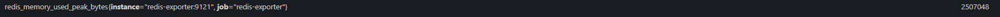
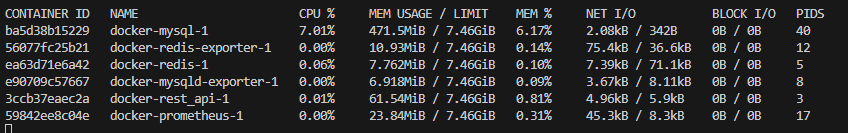

A continuación se desarrollan los 8 puntos del caso, para ello se documenta cada uno de los pasos y se añade el código en general.

## 1. cree una tabla o collection en la base de datos y llenela con 60000 registros ficticios

La base de datos a utilizar corresponde a MySQL. Para la creación de la base de datos e insertar los 60000 datos, se utilizó un archivo .sql, el cual se puede visualizar en el apartado Docker/init.sql 

En la imagen anterior se muestra la creación de la tabla y la creación de los datos que irán dentro de la base de datos.

## 2. agregue un endpoint a su REST api que dado un query y o parámetros retorne aproximadamente un 35% de los registros

Ya que se optó por el uso de Python, una de las tecnologías disponibles en ese lenguaje para la implementación de un servicio REST que utilizaremos es Django, el cual también es de utilidad para el desarrollo del proyecto. En el apartado Python/Django/api/views.py es donde se puede encontrar la lógica del proceso, en el cual se realiza el retorno del 35% de los datos. En la siguiente imagen se muestra la clase y sus funciones. 

En el caso de la creación del EndPoint este es realizado en el apartado Python/Django/api/urls.py. Se añade una imagen donde se realiza dicho proceso.

## 3. agregue otro endpoint a su REST api que haga exactamente lo mismo del punto #2 y que haga uso de un fixed size connection pool para el acceso de la base de datos

Con el fin de no reiterar en las mismas explicaciones del paso anterior, solo serán añadidas imágenes que sean referentes a la creación de los elementosm, a continuación se añaden dichas imágenes. 

Clase donde se realiza el fixed size connection pool.

Creación del segundo EndPoint

## 4. agregue otro endpoint a su REST api que haga exactamente lo mismo del punto #2 y #3 y agregue una cache por medio de un redis server, de tal forma que los parámetros del endpoint sirvan de llave para la cache, permitiendo que hayan cache hits y fails entre los requests

Clase donde se agrega una cache por medio de un redis server.

Creación del tercer EndPoint

A diferencia de los demás, aquí cabe resaltar que Django es muy flexible y tiene cosas interesantes, por lo que la caché de Redis fue manejada desde el archivo settings.py de Django y accedida por la clase.

## 5. una vez terminado y probados los endpoints dockerice la solución, usando un container para el api, otro para redis y otro para la base de datos. utilice docker compose para dockerización. este paso se pudo haber hecho desde el paso #1.

Desde el primer paso se realizó uso de Docker, en este caso se creó una carpeta llamada Docker, en la cual se ubica el docker-compose.yml. Ya que el documento es algo extenso, no se añadirá imagen, pero este paso ya está realizado y se ubica en la ruta Docker/docker-compose.yml

## 6. utilizando postman o jmeter, proceda a ejecutar un test de stress sobre la solución implementada, atacando a los 3 endpoints, configure la prueba para que se simulen 20 clientes (threads) concurrentes haciendo los requests continuamente con una pausa de 233ms entre cada request de cada thread. la prueba completa corre durante 1 minuto.

En este caso se decidió hacer uso de Jmeter. Como primer paso se definen los 20 clientes (threads).

El tiempo es manejado en segundos, por lo que se ingresa un tiempo de 0.233 segundos.

Como segundo paso se crearon las pruebas de los 3 endpoints por lo que se realizá una prueba individual para cada endpoint. 

A continuación se añaden imágenes de las pruebas de 1 minuto de cada endpoint, aclarando que las siguientes imágenes solo evidencian que fueron ejecutados en el tiempo correspondiente los endpoints correspondientes, los datos arrojados serán abordado más adelante:

1. Prueba EndPoint 1:

2. Prueba EndPoint 2:

3. Prueba EndPoint 3:

## 7. extraiga los resultados obtenidos por el software de pruebas (jmeter o postman), de lo que tenga para monitorear conexiones de base de datos, cpu y memoria del lado de los servidores, tabule toda la información asegurándose de tener medidas de las variables:

Para poder monitorear dichos datos se harán uso de dos medidores de métricas, los cuales corresponden a Prometheus y Docker. Se accede a Prometheus usando localhost y el puesto 9090. Para indicar las métricas de cada endpoint, este será indicado por el número incial, siendo el 1. el endpoint 1, el 2. el endpoint 2 y el 3. el endpoint 3.

### Métricas según Prometheus

- cpu, memoria y conexiones de la base de datos para cada endpoint

  - mysql_global_status_queries: Número total de consultas ejecutadas.
  1. 
  2. 
  3. 
  - mysql_global_status_max_used_connections: El máximo número de conexiones simultáneas utilizadas desde que el servidor se inició.
  1. 
  2. 
  3. 
  - mysql_global_status_threads_connected
  1. 
  2. 
  3. 

- cpu, memoria y conexiones de redis para cada endpoint

  - redis_memory_used_bytes: Cantidad de memoria utilizada por Redis.
  1. 
  2. 
  3. 
  - redis_memory_used_peak_bytes: Memoria máxima utilizada por Redis desde que comenzó.
  1. 
  2. 
  3. 
  - redis_cpu_sys_seconds_total: Tiempo de CPU usado por Redis en modo de sistema.
  1. 
  2. 
  3. 
  - redis_cpu_user_seconds_total: Tiempo de CPU utilizado por Redis en el espacio de usuario.
  1. 
  2. 
  3. 

- cpu, memoria y conexiones del backend api para cada endpoint

  - http_requests_total: Total de solicitudes HTTP recibidas por la aplicación Django.
  1. 
  2. 
  3. 

- tiempo promedio de respuesta para cada endpoint. (datos según Jmeter)
  1. 
  2. 
  3. 

### Métricas según Docker

En este caso Docker muestra las las métricas de todo lo que está realizando junto, así que no se hará un apartado como el anterior, así que solo se agregará la imagen y el número de cada endpoint.

Estado inicial de Docker:

1. Datos durante la ejecución del primer endpoint:

2. Datos durante la ejecución del segundo endpoint:

3. Datos durante la ejecución del tercer endpoint:

## 8. emita las conclusiones cuantitativas basadas en los resultados obtenidos que contrasten los cambios de rendimiento usando el framework seleccionado para REST, la incorporación de pool, y de cache respectivamente

En el punto 6 se realizaron las pruebas, pero sin mostrar los datos arrojados en cada una de las pruebas de los endpoints, a continuación se añadirán imágenes relacionadas a cada endpoint para después realizar las conclusiones correspondientes.

1. Prueba EndPoint 1:

2. Prueba EndPoint 2:

3. Prueba EndPoint 3:

Con ayuda de las métricas y gráficas, es posible observar que entre las consultas al endpoint 1 y 2 hay variaciones mínimas respecto a cantidades de datos y recursos utilizados, la mayopr diferencia entre estos dos es que el uso del CPU crece o varía de distinta manera, en las gráficas anteriores, en las de mysql y redis se pueden observar como tiene varios picos una y la otra escala desde la parte más pequeña, respectivamente en el caso del primer endpoint. En el segundo endpoint se evidencia como hay una especie de mayor nivelación, ya que no se presentan estos picos.  Ahora, respecto al tercer endpoint, aquí es donde se presenta la mayor variación, en el caso de las imágenes de Docker, se observa como disminuye el uso del CPU en un 5% aproximadamente y aumenta otro 5% el uso de mysql. También, gracias a la gráfica del tiempo de respuesta, se puede observar que supera significativamente a los otros dos endpoints, los otros presentando picos que iban hasta 900 milisegundos, mientras que el tercer endpoint alcanza picos de hasta 2400 milisegundo, triplicando el tiempo de respuesta comparado a los otros dos. Jmeter nos permite obtener la Deviation y el Average de consulta a los endpoint, el primero indica la dispersión de los tiempos de respuesta con respecto al Average, por lo que se necesita que la Deviation sea menor al Average para asegurar estabilidad en una aplicación o sistema. 

Por último, otro de los detalles que nos proporciona Jmeter es que nos brinda un porcentaje de error, en el caso de las imágenes anteriores se puede observar dicho porcentaje mínimo para los tres endpoint, pero esto considerando que fueron ejecutados por un solo minuto. Pruebas posteriores en las que se dejó ejecutando más tiempo permitió observar que, entre más tiempo se deje ejecutando la consulta en Jmeter, mayor es el índice de error, llegando a alcanzar picos de un 50% de errores cuando se ejecutan los endpoint de manera independiente, en caso de ejecutar los mismo de manera consecutiva, se logran alcanzar picos de hasta 65%, dejando claro que entre más tiempo pasa, más es propenso a comenter errores.
